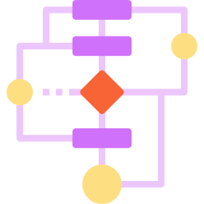

[![MIT License][license-shield]][license-url]
[![LinkedIn][linkedin-shield]][linkedin-url]


<!-- PROJECT LOGO -->
<br />
<p align="center">
  <a href="https://github.com/giveMeLife/EDA_VESPERTINO_USACH">
    
  </a>

  <h2 align="center">Estructura de datos y análisis de algoritmos Vespertino</h2>
  <p align="center">
    Repositorio con el material que se trabajará en el clase a clase del laboratorio de la asignatura EDA de la Universidad de Santiago de Chile en modalidad vespertino.
  </p>
</p>


<!-- TABLE OF CONTENTS -->
<details open="open">
  <summary>Contenidos</summary>
  <ol>
    <li>
      <a href="#acerca-de-la-asignatura">Acerca de la asignatura</a>
      <ul>
        <li><a href="#objetivo-general">Objetivo general</a></li>
        <li><a href="#objetivos-específicos">Objetivos específicos</a></li>
        <li><a href="#requisitos">Requisitos</a></li>
      </ul>
    </li>
    <li>
      <a href="#evaluaciones">Evaluaciones</a>
       <ul>
        <li><a href="#promedio-final">Promedio final</a></li>
      </ul>
    </li>
    <li>
      <a href="#contenidos">Contenidos</a>
       <ul>
        <li><a href="#repaso-de-conceptos">Repaso de conceptos</a></li>
        <li><a href="#listas">Listas</a></li>
        <li><a href="#grafos">Grafos</a></li>
        <li><a href="#árboles">Árboles</a></li>
      </ul>
    </li>
    <li><a href="#contacto">Contacto</a></li>
  </ol>
</details>


<!-- ACERCA DE LA ASIGNATURA -->
## Acerca de la asignatura

### Objetivo general
Asignatura teórico-práctica que tiene como propósito resolver problemas usando algoritmos y estructuras de datos adecuados al contexto de una situación dada. 

### Objetivos específicos
En particular, se espera que el alumno aprenda a aplicar los conceptos de tiempo de ejecución y complejidad algorítmica; diseñar, implementar y modificar estructuras de datos de acuerdo a las necesidades del problema; diseñar algoritmos elementales, iterativos y recursivos; recomendar de manera fundada una estructura de datos para un problema dado.

Las estructuras de datos que se estudiarán son:
<ol>
      <li>Listas</li>
      <li>Grafos</li>
      <li>Árboles</li>
</ol>

### Requisitos

Como requisitos para el laboratorio se considera:
<ol>
      <li>Lenguaje de programación C
        <ul>
           <li>Sistema Operativo UNIX
             <ul>
               <li> Compilador GCC </li>
             </ul>
           </li>
          <li>Sistema Operativo Windows
             <ul>
               <li> Compilador MINGW </li>
             </ul>
           </li>
        </ul>
      </li>
  <li> Editor de texto a eleccion </li>
</ol>


<!-- GETTING STARTED -->
## Evaluaciones

El laboratorio constará de 3 trabajos a desarrollar a lo largo del semestre. Cada uno de estos trabajos tendrá una problemática que contendrá como temática central una estructura de datos a trabajar, la cual debe ser identificada por el estudiante. Posteriormente se deberá implementar en el lenguaje de programación C una solución al problema planteado, utilizando la estructura identificada y aplicando algoritmos específicos sobre dicha estructura.

Cada trabajo constará de dos entregables los cuales se evaluarán de la siguiente forma:
- Código con solución propuesta (60% de la nota).
  -  Estructura y orden.
  -  Comentarios.
  -  Compilación.
  -  Funcionamiento.
- Informe escrito (40% de la nota).
  - Análisis de complejidad de la solución propuesta.
  - Respuesta a preguntas planteadas en el enunciado.

### Promedio final

```javascript
promedio_final = (prom_laboratorio_1 + prom_laboratorio_2 + prom_laboratorio_3)/3
```


## Contenidos


### Repaso de conceptos

See the [open issues](https://github.com/othneildrew/Best-README-Template/issues) for a list of proposed features (and known issues).


### Listas

### Grafos

### Árboles

## Contacto

* Correo: juan.fernandez.m@usach.cl


[license-shield]: https://img.shields.io/github/license/othneildrew/Best-README-Template.svg?style=for-the-badge
[license-url]: https://github.com/othneildrew/Best-README-Template/blob/master/LICENSE.txt
[linkedin-shield]: https://img.shields.io/badge/-LinkedIn-black.svg?style=for-the-badge&logo=linkedin&colorB=555
[linkedin-url]: https://www.linkedin.com/in/juan-antonio-fern%C3%A1ndez-mu%C3%B1oz-2973871a6/
[product-screenshot]: images/screenshot.png
